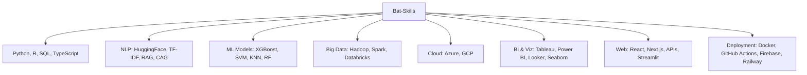

# 🦇 Soumyabrata Ghosh  
## Data Vigilante | AI Craftsman | Business Strategist | Educator of Tomorrow

📍 950 Main Street, Worcester, MA 01610  
📧 [soumyabrata11411@gmail.com](mailto:soumyabrata11411@gmail.com)  
📞 508-353-8921  
🌐 [Portfolio](https://soghosh719.github.io/Soumya_Portfolio/#home)  
💼 [LinkedIn](https://www.linkedin.com/in/soumyabrata-ghosh-205673290/)  
💻 [GitHub](https://github.com/SoGhosh719)

> _"It's not who I am underneath, but what I do that defines me."_  
> _"You either die a noob or live long enough to see yourself become the 10x developer."_

---


```Batcomputer
> INITIALIZING PROFILE SYSTEMS...
> CONNECTING TO GOTHAM CITY NETWORK...
> AUTHENTICATION SUCCESSFUL: WELCOME, COMMISSIONER
> LOADING BAT-STATS [██████████] 100%
> MISSION LOG ACCESSED
---

## 🏙️ Training in the Batcave

**🦇 Clark University – Gotham Division (Worcester, MA)**  
*Master of Science in Business Analytics*  
_Aug 2023 – Present_  
- 🔍 Courses: Machine Learning, Predictive Analytics, BI, Statistical Modeling

**🦇 IISWBM – League of Shadows (Kolkata, India)**  
*PGDM in Business Analytics*  
_Aug 2018 – Dec 2019_  
- 💻 Capstone: Age Detection of Indian Actors (91% accuracy on 26K+ images)

---

## 🛠️ Bat-Tech Inventory



---

## 🧪 Missions from the Bat-Computer (Projects)

- 🏥 **Hospital Readmission** – XGBoost model, 70% risk detection (ROC-AUC: 0.69)
- 💰 **Commodities Forecasting** – Hybrid ARIMA + RF, 95% price prediction accuracy
- 💓 **Chronic Disease Analysis** – Cardio-health trends with 89.5% accuracy
- 🧠 **Twitter Sentiment Analyzer** – 1.6M tweets processed, GBM outperformed SVM/KNN
- 🏫 **University Finder Bot** – Automated scraping/search via APIs (216 universities)
- 🦾 **AI Job Assistant** – NLP + OCR + browser automation for job applications
- ⚗️ **Bonding** – Chemistry community with Next.js + Firebase
- 🎥 **Molecule Animator** – Converts chemical structures into video (Streamlit + OpenCV)
- 🎭 **Hanover Theatre Strategy** – Targeted inclusive marketing plans for students
- 💼 **Payroll System** – Automated small business payroll with tax compliance
- 🚚 **Walmart SCM Case** – Deep dive into supply chain sustainability
- 🏦 **National Bank Forecasting** – Regression model with R² = 0.87 from 22K+ records
- 🏗️ **Lucity Asset Management** – Efficiency analysis for government infrastructure

---

## 🦇 Battle Experience (Professional Work)

**Bharti AXA – Operations Commander (Baripada, India)**  
_Oct 2021 – Aug 2022_  
- 🧠 AI-based automation → +31% productivity  
- 💰 $52K revenue uplift via customer retention strategy  
- 🏅 Ranked 19th nationwide in renewal collections  

**HDFC Ergo – Tactical Financial Agent (Kolkata, India)**  
_Jul 2019 – Oct 2021_  
- 💹 +20% policy sales in Y1  
- 🧾 Outperformed targets 90% of months  
- 📊 Delivered customer analytics to boost retention

**IIT Kanpur – ISMRITI Program Intern**  
_Summer 2019_  
- 🎞️ Flask recommender system using TF-IDF & cosine similarity  
- 🔍 86.7% accuracy with real-time web interface

---

## 🏆 Bat-Suit Certifications

- 🥷 **PCEP** – Entry-Level Python Programmer  
- 🧬 **RCR CITI** – Research Ethics Certified (Valid through 2027)

---

## 🧠 Bat-Signal Toolkit (Tech Summary)

| Domain | Skills |
|--------|--------|
| Languages | Python, R, SQL, JavaScript, TypeScript |
| ML & AI | scikit-learn, XGBoost, TensorFlow, PyTorch |
| NLP | Hugging Face, TF-IDF, SpaCy, NLTK |
| Big Data | Spark, Hadoop, Databricks |
| BI Tools | Tableau, Power BI, Looker, Seaborn |
| Cloud | Azure, GCP, Firebase |
| Web Dev | React, Streamlit, Flask, Next.js |
| DevOps | Docker, GitHub Actions, Vercel |
| Design | Figma, Mermaid.js, Lucidchart |

---

<details>
<summary>🦇 Why Batman?</summary>

Because Batman is the ultimate analyst.  
He prepares relentlessly, masters his tools, adapts to chaos, and never stops optimizing.  
In a world full of uncertainty and noise, I strive to be the Dark Knight of Data — bringing clarity, logic, and strategy to every mission.

</details>

---

📬 **Let’s Team Up**  
Have a mission, a challenge, or a mystery to solve?  
Reach me via [📧 Bat Signal](mailto:soumyabrata11411@gmail.com)
